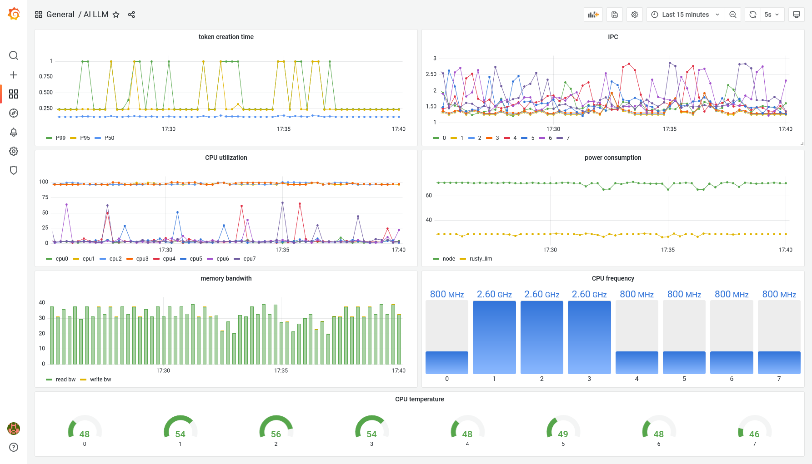

# Rust based AI LLM inference service

This repository contains all code to run a super simple AI LLM model - such as [Mistral 7b](https://mistral.ai/news/announcing-mistral-7b/); probably currently the 
best model to run locally - for inference; it includes simple RAG functionalities. Most importantly it exposes metrics 
about how long it took to create a response, as well as how long it took to generate the tokens.

Currently, uses [llama_cpp](https://github.com/edgenai/llama_cpp-rs) and [candle](https://github.com/huggingface/candle) - 
although I hope to replace the latter over time for performance reasons. 

## Warning

    This is for testing only; Use at your own risk! Main purpose is to learn hands-up on how this stuff works and to 
    intrument and characterize the behaviour of AI LLMs.

## Observability

The following key metrics are exposed through [Prometheus](https://prometheus.io/docs/practices/histograms/):

* *token_creation_duration* - Histogram for the time it took to generate the tokens.
* *inference_response_duration* - Histogram for the time it took to generate the full response (includes tokenization 
  and embedding additional context).
* *embedding_duration* - Histogram for the time it took to create a vector representation of the query and lookup 
  contextual information in the knowledge base.
* TODO: add more such as time it took to tokenize, read from KV store etc; also check if we can add tracing. 

Here is an example dashboard that capture the metrics described as well as some host metrics such as power, CPU
utilisation etc.:

## Prerequisites

You will need to download a model & matching tokenizer file:

  * This [mistral-7b-instruct-v0.2.Q4_K_M.gguf](https://huggingface.co/TheBloke/Mistral-7B-Instruct-v0.2-GGUF/tree/main) 
    model seems to give reasonable good results.
  * This [tokenizer.json](https://huggingface.co/mistralai/Mistral-7B-v0.1/blob/main/tokenizer.json) works as well.

Best to put both files into a *model/* folder as *model.gguf* and *tokenizer.json*.

## Configuration

This service can be configured through environment variables. The following variables are supported:

| Environment variable    | Description                                                           | Example/Default          |
|-------------------------|-----------------------------------------------------------------------|--------------------------|
| DATA_PATH               | Directory path from which to read text files into the knowledge base. | data                     |
| EMBEDDING_MODEL         | Name of the embedding model to user (will be downloaded using HF).    | "BAAI/bge-small-en-v1.5" |
| HTTP_ADDRESS            | Bind address to use.                                                  | 127.0.0.1:8080           |
| HTTP_WORKERS            | Number of threads to run with the HTTP server.                        | 1                        |
| MODEL_BATCH_SIZE        | Batch size to use.                                                    | 8                        |
| MODEL_GPU_LAYERS        | Number of layers to offload to GPU.                                   | 0                        |
| MODEL_MAX_TOKEN         | Maximum number of tokens to generate.                                 | 128                      |
| MODEL_PATH              | Full path to the gguf file of the model.                              | model/model.gguf         |
| MODEL_THREADS           | Number of threads we'll use for inference.                            | 6                        |
| PROMETHEUS_HTTP_ADDRESS | Bind address to use for prometheus.                                   | 127.0.0.1:8081           |

Other environment variables such as RUST_LOG can also be used.

## Examples

The following [curl](https://curl.se/) commands show the format the service understands:

    $ curl -X POST localhost:8080/query -d '{"query": "Who was Albert Einstein?"}' -H "Content-Type: application/json"
    {"response":"[INST]Using this information: [] answer the Question: Who was Albert Einstein?[/INST] Albert Einstein 
    (14 March 1879 – 18 April 1955) was a German-born theoretical physicist [...]"}

You can also test if the RAG works by running the following query - notice how easy it is to trick these word 
prediction machines:

    $ curl -X POST localhost:8080/query -d '{"query": "Who was thom Rhubarb?"}' -H "Content-Type: application/json"

## Kubernetes based deployment

The [Dockerfile](Dockerfile) to build the image is best used on a machine with the same CPU as were it will be deployed 
as it uses *target-cpu=native* flag. Note that is also can optionally also include options to build with CLBlast for 
GPU support.

Use the following [example manifest](k8s_deployment.yaml) to deploy this application:

    kubectl apply -f k8s_deployment.yaml

***Note***: make sure to adapt the docker image & paths - the manifest above uses hostPaths!

## Changelog

  * 0.1.0 - initial release.
  * 0.2.0 - switch from [llama_cpp](https://github.com/edgenai/llama_cpp-rs) as [llm](https://github.com/rustformers/llm) stopped development.

## Further reading

Some of the following links can be useful:

  * https://docs.mistral.ai/guides/basic-RAG/
  * https://medium.com/@isalapiyarisi/lets-build-a-standalone-chatbot-with-phi-2-and-rust-48c0f714f915
